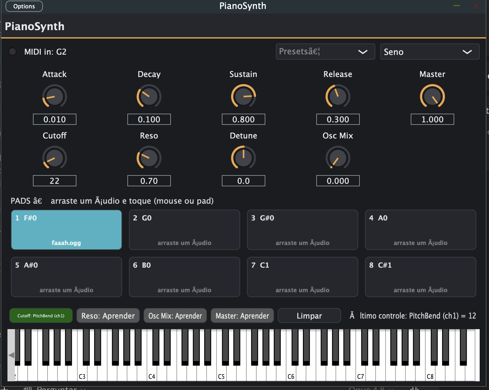

# FireSynth

**A synthesizer app built for the AMW Mini 32p MIDI keyboard** — written in JUCE 8 /
C++20, running as **Standalone**, **VST3** and **AU**. Play it from the hardware keyboard
or the on-screen keyboard, with oscillators + filter + ADSR, master effects (Drive,
Reverb), **16 sample pads** (drag an audio file onto a pad) and full mapping of the
AMW Mini 32p controls — including the 4 knobs.



## Features

- **Synth engine:** 16 voices, 4 waveforms (Sine / Saw / Square / Triangle, PolyBLEP
  anti-aliasing), 2 oscillators per voice with detune + mix, a resonant low-pass filter
  (cutoff + resonance) and an ADSR envelope. Pitch bend and mod-wheel vibrato.
- **Master effects:** Drive (saturation) and Reverb — always audible, applied to the
  synth and the pads.
- **16 sample pads:** two banks of 8 (A/B). Drag an audio file (WAV/AIFF/FLAC/OGG) onto a
  pad and play it (mouse or hardware pad). Pads run through the pitch bend + filter too.
  Thread-safe loading, lock-free playback.
- **Presets:** Organ, Synth Bass, Lead, Pad, Pluck.
- **On-screen Pitch / Modulation wheels** that mirror the hardware.

## AMW Mini 32p mapping

| Control | MIDI message | Function |
|---|---|---|
| Keys (32) | Note On/Off + Velocity | Play the synth |
| Pitch wheel | Pitch Bend | Musical pitch bend (±2 semitones), also bends the pads |
| Modulation wheel | CC 1 | Vibrato |
| Volume | CC 7 | Master Gain |
| 8 pads × A/B | Note On (ch10, notes 30–45) | Trigger the 16 pad samples |
| 4 knobs | CC 20–23 | Assignable parameters (default: Cutoff, Resonance, Drive, Reverb) |

### Making the 4 knobs work

Out of the box the AMW Mini 32p's 4 knobs send an identical Pitch Bend, so they can't be
told apart. Reconfigure them once with the **MIDIPLUS Mini32P MIDI Editor** to send four
distinct CCs — **Knob 1 → CC 20, Knob 2 → CC 21, Knob 3 → CC 22, Knob 4 → CC 23** — and
write to the device. FireSynth then maps each knob independently; pick the target parameter
per knob from the **KNOBS** selectors in the UI.

> macOS tip: the editor is an old Intel app — if its window doesn't appear, launch it fresh
> with `open -F "MIDIPlUS minicontrol.app"` (it was restoring an off-screen window).

## Architecture (overview)

Audio and GUI threads are strictly separated: the GUI writes parameters via
`AudioProcessorValueTreeState` (atomic, lock-free); the audio thread only reads. Pad samples
use an atomic pointer + `ReferenceCountedArray` (no allocation/locks on the audio thread).
MIDI is routed in `processBlock`: pad notes (ch10) trigger samples, everything else goes to
the voices; CC 20–23 drive the mapped parameters.

| File | Role |
|---|---|
| `Source/PluginProcessor.*` | Engine: synthesis, APVTS, MIDI routing, master FX, mix |
| `Source/dsp/SynthVoice.*` | Voice: 2 osc + filter + ADSR + pitch/vibrato |
| `Source/dsp/Oscillator.h` | Waveforms (PolyBLEP) |
| `Source/dsp/PadEngine.*` | 16-pad sample playback (pitch + filter) |
| `Source/ui/*` | LookAndFeel, pad and wheel components |
| `Source/PluginEditor.*` | GUI |

## Build & Run

Requires CMake ≥ 3.22 and a C++20 compiler. The first build downloads JUCE 8 (needs network).

```bash
./run.sh                 # Release build + open the app
./run.sh --debug         # Debug build
./run.sh --build-only    # compile only
```

## Roadmap

- [ ] Per-pad volume / pitch and loop mode.
- [ ] Real acoustic piano via multi-sample sampler.
- [ ] More master effects (delay, chorus).
